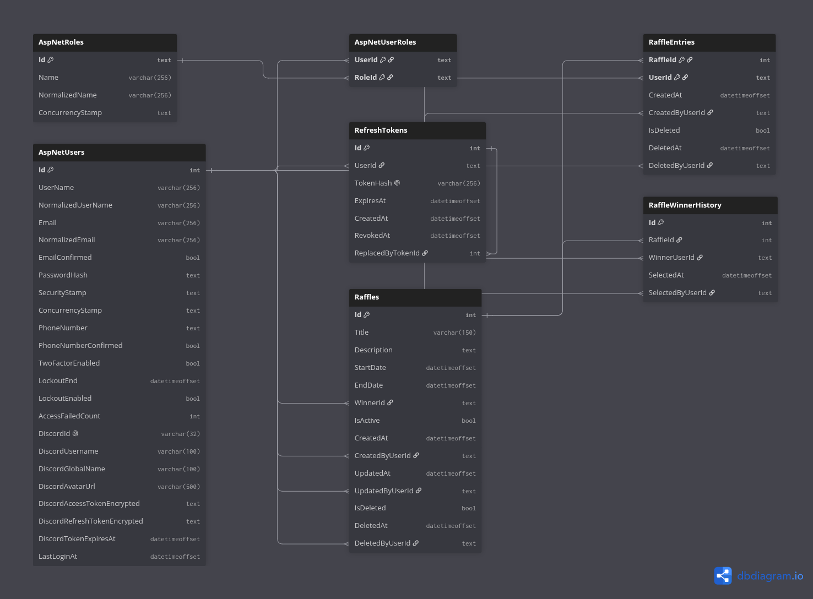

# Base de Datos

## Modelo Relacional

## Diccionario de Datos: App de Sorteos (DevTalles)

Este diccionario de datos describe el esquema relacional en PostgreSQL para la aplicación de sorteos, basado en un modelo customizado de ASP.NET Core Identity adaptado para autenticación exclusiva vía Discord OAuth2.

### Módulo: Identity (Autenticación y Usuarios)

#### 1. Tabla: `AspNetRoles`

Almacena los roles de autorización del sistema. En este proyecto, su uso es mínimo ya que solo existe el rol de administrador.

- **Nota general:** Cualquier usuario autenticado sin registro en `AspNetUserRoles` se considera participante regular por defecto.

| **Columna**        | **Tipo de Dato** | **Restricciones** | **Descripción**                                              |
| ------------------ | ---------------- | ----------------- | ------------------------------------------------------------ |
| `Id`               | `text`           | PK                | Identificador único del rol.                                 |
| `Name`             | `varchar(256)`   |                   | Nombre del rol (Ej. "Admin"). Solo existe esta fila.         |
| `NormalizedName`   | `varchar(256)`   |                   | Nombre normalizado (generalmente en mayúsculas) para búsquedas. |
| `ConcurrencyStamp` | `text`           |                   | Gestionado internamente por Identity; no usado por la lógica de negocio. |

#### 2. Tabla: `AspNetUsers`

Almacena la información de los usuarios. Está fuertemente adaptada para delegar la identidad a Discord. Los campos estándar de contraseña y email de Identity están deshabilitados o ignorados.

| **Columna**                    | **Tipo de Dato** | **Restricciones** | **Descripción**                                              |
| ------------------------------ | ---------------- | ----------------- | ------------------------------------------------------------ |
| `Id`                           | `int`            | PK                | Identificador interno del usuario. *(Nota: En los FKs de otras tablas aparece referenciado como `text`, sugerencia revisar tipo en código).* |
| `UserName`                     | `varchar(256)`   |                   | Sincronizado con `DiscordUsername` en cada login.            |
| `NormalizedUserName`           | `varchar(256)`   |                   | Nombre de usuario normalizado para búsquedas de Identity.    |
| `Email`                        | `varchar(256)`   | Nullable          | No usado (no hay flujo de autenticación por email).          |
| `NormalizedEmail`              | `varchar(256)`   | Nullable          | No usado.                                                    |
| `EmailConfirmed`               | `bool`           |                   | No usado.                                                    |
| `PasswordHash`                 | `text`           | Nullable          | No usado (no hay login local con contraseña).                |
| `SecurityStamp`                | `text`           |                   | No usado.                                                    |
| `ConcurrencyStamp`             | `text`           |                   | Gestionado por Identity, no usado por negocio.               |
| `PhoneNumber`                  | `text`           | Nullable          | No usado.                                                    |
| `PhoneNumberConfirmed`         | `bool`           |                   | No usado.                                                    |
| `TwoFactorEnabled`             | `bool`           |                   | No usado.                                                    |
| `LockoutEnd`                   | `datetimeoffset` | Nullable          | No usado.                                                    |
| `LockoutEnabled`               | `bool`           |                   | No usado.                                                    |
| `AccessFailedCount`            | `int`            |                   | No usado.                                                    |
| `DiscordId`                    | `varchar(32)`    | Unique            | Snowflake ID de Discord. Identidad externa primaria e inmutable. |
| `DiscordUsername`              | `varchar(100)`   |                   | Snapshot del username, actualizado en cada login.            |
| `DiscordGlobalName`            | `varchar(100)`   | Nullable          | Display name de Discord mostrado en la UI.                   |
| `DiscordAvatarUrl`             | `varchar(500)`   | Nullable          | URL del avatar del usuario en Discord.                       |
| `DiscordAccessTokenEncrypted`  | `text`           | Nullable          | Cifrado en reposo. Permite re-validar pertenencia al servidor sin re-pedir consentimiento. |
| `DiscordRefreshTokenEncrypted` | `text`           | Nullable          | Cifrado en reposo. Usado para renovar el access token silenciosamente. |
| `DiscordTokenExpiresAt`        | `datetimeoffset` | Nullable          | Fecha y hora de expiración del token de Discord.             |
| `LastLoginAt`                  | `datetimeoffset` | Nullable          | Fecha y hora del último inicio de sesión del usuario.        |

#### 3. Tabla: `AspNetUserRoles`

Tabla puente (Many-to-Many) que vincula usuarios con sus roles (principalmente para asignar Admins).

| **Columna** | **Tipo de Dato** | **Restricciones** | **Descripción**                           |
| ----------- | ---------------- | ----------------- | ----------------------------------------- |
| `UserId`    | `text`           | PK, FK            | Referencia al usuario (`AspNetUsers.Id`). |
| `RoleId`    | `text`           | PK, FK            | Referencia al rol (`AspNetRoles.Id`).     |

### Módulo: Autenticación Propia (JWT)

#### 4. Tabla: `RefreshTokens`

Gestiona la sesión a largo plazo del usuario (los Access Tokens son de corta vida y no se persisten). Permite renovar la sesión sin re-autenticar contra Discord.

| **Columna**         | **Tipo de Dato** | **Restricciones** | **Descripción**                                              |
| ------------------- | ---------------- | ----------------- | ------------------------------------------------------------ |
| `Id`                | `int`            | PK, Auto-inc      | Identificador único del token.                               |
| `UserId`            | `text`           | FK                | Referencia al usuario propietario (`AspNetUsers.Id`).        |
| `TokenHash`         | `varchar(256)`   | Unique            | Hash SHA-256 del refresh token (el valor crudo nunca se persiste). |
| `ExpiresAt`         | `datetimeoffset` |                   | Fecha y hora de expiración del token.                        |
| `CreatedAt`         | `datetimeoffset` | Default `now()`   | Momento exacto de la emisión del token.                      |
| `RevokedAt`         | `datetimeoffset` | Nullable          | Registra revocación manual (logout) o al rotar el token.     |
| `ReplacedByTokenId` | `int`            | FK, Nullable      | Referencia a otro `RefreshTokens.Id` para auditoría de cadena de rotación. |

### Módulo: Dominio (Sorteos)

#### 5. Tabla: `Raffles`

Entidad principal del negocio. Representa un sorteo, sus reglas de tiempo, y el ganador final.

- **Ciclo de vida:** Abierto cuando `IsActive = true` y `now()` está entre `StartDate` y `EndDate`.
- **Control de concurrencia:** Se utiliza la columna oculta de sistema de PostgreSQL `xmin` (mapeada vía EF Core `IsRowVersion()`) para evitar colisiones al seleccionar ganadores.

| **Columna**       | **Tipo de Dato** | **Restricciones** | **Descripción**                                              |
| ----------------- | ---------------- | ----------------- | ------------------------------------------------------------ |
| `Id`              | `int`            | PK, Auto-inc      | Identificador único del sorteo.                              |
| `Title`           | `varchar(150)`   |                   | Título del sorteo (Solo lectura si hay ganador).             |
| `Description`     | `text`           | Nullable          | Texto libre que describe la dinámica y el premio.            |
| `StartDate`       | `datetimeoffset` |                   | Fecha de inicio (UTC) habilitada para participar.            |
| `EndDate`         | `datetimeoffset` |                   | Fecha de fin (UTC). La selección de ganador ocurre después.  |
| `WinnerId`        | `text`           | FK, Nullable      | Refleja la fila más reciente en `RaffleWinnerHistory`. Desnormalizado para lecturas rápidas (`AspNetUsers.Id`). |
| `IsActive`        | `bool`           | Default `true`    | `false` indica sorteo cerrado o cancelado por Admin. No se reabre solo. |
| `CreatedAt`       | `datetimeoffset` | Default `now()`   | Fecha de creación.                                           |
| `CreatedByUserId` | `text`           | FK                | Admin que creó el sorteo (`AspNetUsers.Id`).                 |
| `UpdatedAt`       | `datetimeoffset` | Nullable          | Fecha de última modificación.                                |
| `UpdatedByUserId` | `text`           | FK, Nullable      | Admin que modificó el sorteo por última vez.                 |
| `IsDeleted`       | `bool`           | Default `false`   | Indicador de baja lógica (Soft delete).                      |
| `DeletedAt`       | `datetimeoffset` | Nullable          | Fecha en la que se aplicó la baja lógica.                    |
| `DeletedByUserId` | `text`           | FK, Nullable      | Admin que eliminó el sorteo.                                 |

#### 6. Tabla: `RaffleEntries`

Registra las participaciones de los usuarios en los sorteos.

- **Nota de restricción:** La clave primaria compuesta impide dobles participaciones. No se contempla que el usuario cancele su propia entrada.

| **Columna**       | **Tipo de Dato** | **Restricciones** | **Descripción**                                              |
| ----------------- | ---------------- | ----------------- | ------------------------------------------------------------ |
| `RaffleId`        | `int`            | PK, FK            | Referencia al sorteo en el que participa (`Raffles.Id`).     |
| `UserId`          | `text`           | PK, FK            | Referencia al participante (`AspNetUsers.Id`). (Indexado para búsquedas). |
| `CreatedAt`       | `datetimeoffset` | Default `now()`   | Funciona como `JoinedAt` (momento exacto de ingreso al sorteo). |
| `CreatedByUserId` | `text`           | FK                | Siempre igual a `UserId`. Mantenido por consistencia de auditoría. |
| `IsDeleted`       | `bool`           | Default `false`   | Si es `true`, un Admin invalidó la participación (ej. fraude). No libera la PK para re-inscribirse. |
| `DeletedAt`       | `datetimeoffset` | Nullable          | Fecha de invalidación de la participación.                   |
| `DeletedByUserId` | `text`           | FK, Nullable      | Admin que invalidó la participación.                         |

#### 7. Tabla: `RaffleWinnerHistory`

Tabla de solo inserción (Append-only) que audita las selecciones y re-selecciones de ganadores.

| **Columna**        | **Tipo de Dato** | **Restricciones** | **Descripción**                                              |
| ------------------ | ---------------- | ----------------- | ------------------------------------------------------------ |
| `Id`               | `int`            | PK, Auto-inc      | Identificador único del evento de selección.                 |
| `RaffleId`         | `int`            | FK                | Referencia al sorteo afectado (`Raffles.Id`).                |
| `WinnerUserId`     | `text`           | FK                | Referencia al usuario ganador seleccionado (`AspNetUsers.Id`). |
| `SelectedAt`       | `datetimeoffset` | Default `now()`   | Momento exacto en que se seleccionó al ganador.              |
| `SelectedByUserId` | `text`           | FK                | Admin que ejecutó la acción de sortear/resortear.            |